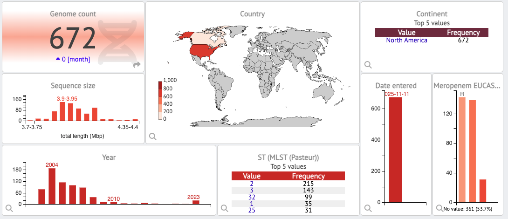

# Hybrid model building for Carbapenem resistance in *A. baumanii*

Detailed workflow to use **BAMPS-ML** to predict antimicrobial susceptibility profiles and MIC values from genomic data, as desceribed in **Pascoe & Mourkas *et al.* (TBC)** This is a reproducible end-to-end workflow that prioritises a single path run that can be extended to additional antibiotics and feature sets.

## Environment
Option A: conda (recommended)

```bash
conda env create bamps-ml
conda activate bamps-ml
```

Option B: pip

```bash
pip install -r requirements.txt
```

## Data layout
Expected paths (example):

```bash
data/
  genomes/
    SAMPLE_001.fasta
    SAMPLE_002.fasta
  phenotypes/
    phenotypes.tsv
```

phenotypes.tsv minimum columns:
- ``sample_id``
- one column per antibiotic (either MIC numeric or categorical label)

---
# DATASET
---

Download contigs here: 

```bash
cd ~/BAMPY_ML/data

wget -c link to dataset contigs on figshare
tar -zxfv contigs.russi280.tar.gz
```


## Normalise phenotype calling (optional)

If MIC tables contain raw values only, BAMPS-ML can derive S/I/R labels using ``breakpoints.py`` and a chosen standard (e.g. CLSI / EUCAST), or per-antibiotic overrides defined in the config.

```bash
insert
```

---
# BUILD A MODEL
---

Inputs:
- Assemblies: ``data/contigs280/`` (FASTA contigs; filenames must map to sample IDs)
- Phenotypes: ``data/mic_values.norm.csv`` (MIC table; includes imipenem/meropenem etc.)
- Config: ``config/config_ACB_reg.yaml`` (regression / MIC modelling)

Outputs:
- Trained models per antibiotic (and per feature-set)
- Benchmarking metrics (ROC/AUC, PR-AUC, calibration, confusion matrices)
- Interpretation outputs (top features, SHAP summaries)
- Reproducible run folder with configs and logs

## Feature extraction

### Step 1: Generate AMR determinant features (AMRFinderPlus)

Run AMRFinderPlus externally or via the wrapper script, then generate a per-sample feature matrix.

```bash
python scripts/run_amrfinder.py \
  --genome-dir data/contigs280 \
  --output-dir outputs/amrfinder/Russia280 \
  --threads 8
```

**OUTPUTS:** This produces individual files per genome and a combined AMR feature table in the output directory 
- ``outputs/amrfinder/Russia280/amr_presence_absence.tsv``
- ``outputs/amrfinder/Russia280/amr_presence_absence.norm.tsv``
- ``outputs/amrfinder/Russia280/raw/*.amrfinder.tsv``

The combined feature table uses **sample ID** as the primary key.

### Step 2A: Train an MIC prediction model (regression; example: imipenem)

The AMRFinder feature table uses sample as the ID column.
The MIC table contains both sample and ID; BAMPS-ML automatically prefers sample for joining.

```bash
python scripts/train_model.py \
  --feature-table outputs/amrfinder/Russia280/amr_presence_absence.norm.tsv \
  --mic-file data/mic_values.norm.csv \
  --task regression \
  --classifier xgb \
  --model-dir outputs/ml_models/imipenem_amrfinder_mic \
  --plot-dir outputs/plots/imipenem_amrfinder_mic \
  --random-state 1 \
  --n-jobs 8 \
  --self-test
```

*Notes*
- ``--self-test`` performs an internal 75/25 split for quick diagnostics.
- Use ``--tune`` for hyperparameter optimisation.
- Use ``--bootstrap-reps`` to quantify uncertainty.
- On older systems, prefer ``--classifier lgbm`` or ``ridge`` over XGBoost.

### Step 2B: Train an S/R prediction model (classification; example: imipenem)

```bash
python scripts/train_model.py \
  --feature-table outputs/amrfinder/Russia280/amr_presence_absence.norm.tsv \
  --mic-file data/mic_values.norm.csv \
  --task classification \
  --classifier xgb \
  --model-dir outputs/ml_models/imipenem_amrfinder_SIR \
  --plot-dir outputs/plots/imipenem_amrfinder_SIR \
  --random-state 1 \
  --n-jobs 8 \
  --self-test
```

*coming soon*
- refinement for under / oversampling
- bootstraping and propagation of uncertainty
- fold validation

### Rerun for multiple antibioitcs

The script ``scripts/run_golden_path.sh`` reproduces the model building path with variables at the top (i.e. run for additional antibiotics). Including the flag ``--all`` buidls models or all antibioitcs included as columns in your input phenotype file.

```bash
insert
```

### Self test evaluation

``Add detail``
+ confusion matrices
  
*Interpretation: The baseline AMRFinder-only model shows moderate performance but systematic under-prediction of high MICs. This behaviour motivates hyperparameter tuning, and retraining.*

---
# MODEL TUNING AND RETRAINING
---

The model can be tuned using different ML classifiers and a selection (xgBoost, LGMboost, ridge, linear regression) of common hyperparameter values using ``tune_model.py``

```bash
python scripts/tune_model.py \
  --feature-table outputs/amrfinder/Russia280/amr_presence_absence.norm.tsv \
  --mic-file data/mic_values.norm.csv \
  --task regression \
  --classifier xgb \
  --antibiotics imipenem meropenem \
  --log2 \
  --n-iter 80 \
  --cv 5 \
  --n-jobs 8 \
  --outdir outputs/tuning/imi_mer_xgb_log2
```

This produces:
- ``tuning/summary.tsv``
- ``tuning/cv_results_<antibiotic>.tsv``
- ``models/<antibiotic>__<task>__<classifier>.pkl``
- ``models/<antibiotic>__...__metadata.yaml``

And we can retrain our model using --tune to select a tuned model, or --best to choose the best performing model from summary.tsv

```bash
python scripts/train_model.py \
  --feature-table outputs/amrfinder/Russia280/amr_presence_absence.norm.tsv \
  --mic-file data/mic_values.norm.csv \
  --task classification \
  --classifier xgb \
  --model-dir outputs/ml_models/imipenem_amrfinder_SIR \
  --plot-dir outputs/plots/imipenem_amrfinder_SIR \
  --random-state 1 \
  --n-jobs 8 \
  --self-test
```

---
# VALIDATE MODEL
---

A validation dataset of sequenced genomes, with correspondign MIC data was downloaded from the [Acinetobacter baumannii IOI Collection v1 database](https://bioinf.ineosoxford.ox.ac.uk/bigsdb?db=ioi_abaumannii_isolates) (n=672; login required)



**Figure 1: Dashbaord overview of validation dataset.** The validation dataset includes 672 *A. baumannii* genomes with matched MIC data, primarily from North America, spanning 2004–2023. Assemblies show consistent genome sizes (~3.9 Mb) and encompass diverse Pasteur MLST lineages. Meropenem susceptibility profiles reveal a high prevalence of resistance alongside susceptible isolates, providing a robust and clinically relevant benchmark for evaluating MIC prediction performance, particularly for carbapenems.

This validation step quantifies:
- Absolute MIC prediction accuracy
- Improvement from ML vs rule-based AMR
- Added value of GWAS-derived determinants
- Lineage-specific performance gains

## Download data an clean input
Download contig files and correspondign phenotype data from the *A. baumanii* IOI collection:


You can also download the contigs from here:

```bash
cd /<your_location>/BAMPS_ML/data

wget -c https://figshare.com/ndownloader/files/61226248?private_link=5e5b1065edad79c38c3a
tar -zxfv contigs_validation.tar.gz
```


Check and clean data formats:

```
insert
```

## Inputs
- Validation contigs: ``data/contigs_validation_dataset/``
- Validation phenotypes (MICs): ``data/phenotypes_validation/validation_dataset_MIC.csv``
  - Supported formats:
    - **wide**: one row per sample, MIC columns per antibiotic (e.g., ``imipenem``, ``meropenem``, ...)
    - **long**: columns ``sample``, ``antibiotic``, ``mic``
- Trained models: ``outputs/runs/<RUN_NAME>/models/*_regression.pkl``

The plotting/metrics script auto-detects wide vs long and standardises internally.

### Step A — Build AMRFinder features for validation contigs

```bash
python scripts/run_amrfinder.py \
  --genome-dir data/contigs_validation_dataset \
  --output-dir outputs/amrfinder/validation \
  --threads 8
```

This produces (example):
- ``outputs/amrfinder/validation/amr_presence_absence.tsv``

### Step B — Predict MICs on validation isolates using trained models

**Batch prediction + plots + metrics**

This writes one tidy TSV per antibiotic (prefixed ``preds_...``) and generates MIC panel plots.

```bash
python scripts/predict_all.py \
  --feature-table outputs/amrfinder/validation/amr_presence_absence.tsv \
  --model-dir outputs/runs/001_Russia280_AMRFinder_MIC_panel_xgb/models \
  --outdir preds \
  --tasks regression \
  --to-mic \
  --panel-out preds/validation_MIC_panel \
  --panel-truth data/phenotypes_validation/validation_dataset_MIC.csv \
  --metrics-out preds/validation_metrics.tsv \
```

Outputs: 
- ``preds/preds_<antibiotic>_mic.tsv`` (one per antibiotic)
- ``preds/validation_MIC_panel.png`` + ``.svg``
- ``preds/validation_metrics.tsv`` (per-antibiotic validation metrics)
- (Optional) lineage-stratified panels: ``preds/validation_MIC_panel.lineage_<X>.png`` + ``.svg`` (top ``N`` lineages)

**Single antibiotic (regression; MIC)**

```bash
python scripts/predict.py \
  --feature-table outputs/amrfinder/validation/amr_presence_absence.tsv \
  --model-dir outputs/runs/001_Russia280_AMRFinder_MIC_panel_xgb/models \
  --antibiotic imipenem \
  --task regression \
  --to-mic \
  --output preds/preds_imipenem_mic.tsv
```

**Single antibiotic (classification; S/I/R)**

```bash
python scripts/predict.py \
  --feature-table outputs/amrfinder/validation/amr_presence_absence.tsv \
  --model-dir outputs/runs/001_Russia280_AMRFinder_MIC_panel_xgb/models \
  --antibiotic imipenem \
  --task classification \
  --output preds/preds_imipenem_SIR.tsv
```

### Step C — Evaluate baseline performance
The pipeline writes ``preds/validation_metrics.tsv`` with per-antibiotic validation performance.

Minimum “paper-grade” validation metrics per antibiotic:
- R² on log2(MIC) (regression goodness-of-fit)
- MAE in log2 units (average error in dilution steps)
- Within ±1 dilution accuracy (clinically intuitive)

These are also auto-embedded into the MIC panel figure annotations (per antibiotic).

This is aour baseline model, which we can evaluate with ``evaluate_mic_predictions``, which produces:


**Figure X:** Model evaluation.

*Interpretation:*
The baseline AMRFinder-only model shows:
- Imipenem: moderate performance but systematic under-prediction of high MICs
- Meropenem: poor calibration and limited discrimination

This behaviour motivates:
- hyperparameter tuning, and
- inclusion of GWAS-derived determinants to capture resistance mechanisms not represented in curated AMR databases.

---
FEATURE DISCOVERY (optional)
---

## Hybrid AMR + GWAS models
GWAS signals (unitigs, SNPs, gene presence/absence) are integrated alongside AMRFinder features to improve MIC prediction for carbapenems. (e.g., PYSEER GWAS output)

### Merge PYSEER GWAS outputs 
Helper script to merge GWAS outputs from gene presence / absence, SNP and unitigs (kmer) analyses: 'Bens_script' (add link)

```bash
how to run
```

### Pass GWAS features directly:

```bash
python scripts/train_model.py \
  --feature-table outputs/amrfinder/contigs280/amr_features.tsv \
  --gwas-table outputs/gwas/unitigs_matrix.tsv \
  --gwas-top-k 5000 \
  --amr-prefix AMR_ \
  --gwas-prefix GWAS_ \
  --mic-file data/mic_values.norm.csv \
  --task regression \
  --classifier xgb \
  --model-dir outputs/ml_models/imipenem_hybrid_mic \
  --plot-dir outputs/plots_hybrid/imipenem_hybrid_mic \
  --random-state 1 \
  --self-test
```

## Compare hybrid models

---
# MAKE GLOBAL PREDICTIONS
---

Prediction dataset: pubMLST (add link)

Input
- contigs
- validated model.pkl
- metadata.csv

Download contigs here: 

```bash
wget link to dataset contigs on figshare
```

## Use constructed model to make predictions 

Using prediction script

```bash
how to run it
```

## Outputs:
-
-
-

Breakdown outputs by metadata (country, host, etc.)
Self test?
Metrics

## (optional) Compare hybrid models

---

## Reproducibility checklist (minimum)
For each run, record:
- exact command used
- git commit hash (if available)
- config YAML used
- random seed
- software versions (conda list > versions.txt)

## Software and links
AMRfinderPlus
PROKKA / BAKTA
PIRATE
PIRATE post-processing scripts
PYSEER
PYSEER post-processing scripts

FigShare: dataset [contigs]
Figshare: validation dataset [contigs]
Microreact: dataset
Microreact: validation dataset
Microreact: Global prediction dataset
IOI Collections: [*A. baumanii*](https://bioinf.ineosoxford.ox.ac.uk/bigsdb?db=ioi_abaumannii_isolates)
PubMLST database (*A. baumanii*)

---
## Please cite: 
Pascoe & Mourkas TBC
